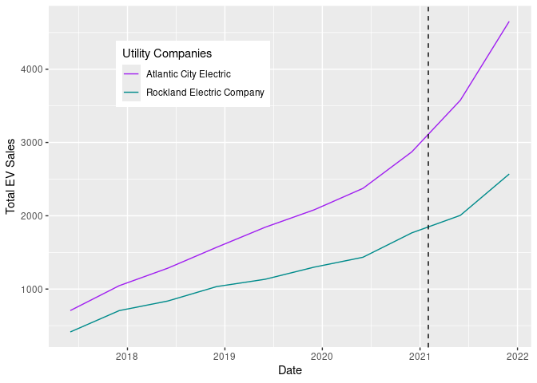

# What is the impact of utility companies’ charging station rebates on
EV adoption in Maryland?


Step 1. Install necessary packages.

``` r
install.packages("tidyverse")
```

    Installing package into '/cloud/lib/x86_64-pc-linux-gnu-library/4.4'
    (as 'lib' is unspecified)

``` r
install.packages("kableExtra")
```

    Installing package into '/cloud/lib/x86_64-pc-linux-gnu-library/4.4'
    (as 'lib' is unspecified)

Step 2. Declare that you will use these packages in this session.

``` r
library("tidyverse")
```

    ── Attaching core tidyverse packages ──────────────────────── tidyverse 2.0.0 ──
    ✔ dplyr     1.1.4     ✔ readr     2.1.5
    ✔ forcats   1.0.0     ✔ stringr   1.5.1
    ✔ ggplot2   3.5.1     ✔ tibble    3.2.1
    ✔ lubridate 1.9.3     ✔ tidyr     1.3.1
    ✔ purrr     1.0.2     
    ── Conflicts ────────────────────────────────────────── tidyverse_conflicts() ──
    ✖ dplyr::filter() masks stats::filter()
    ✖ dplyr::lag()    masks stats::lag()
    ℹ Use the conflicted package (<http://conflicted.r-lib.org/>) to force all conflicts to become errors

``` r
library("kableExtra")
```


    Attaching package: 'kableExtra'

    The following object is masked from 'package:dplyr':

        group_rows

Step 3. Upload the dataframe that you have created in Spring 2024 into
the repository.

Step 4. Open the dataframe into the RStudio Environment.

``` r
df<-read.csv("panel (1).csv")
```

Step 5. Use the **head** and **kable** function showcase the first 10
rows of the dataframe to the reader.

``` r
kable(head(df))
```

| X | ZIP.Code | NAME | Registration.Date | Vehicle.Count | AEC_Rebate | AEC | PSEG_Rebate | PSEG | REC_Rebate | REC | JCPL_Rebate | JCPL |
|---:|---:|:---|:---|---:|---:|---:|---:|---:|---:|---:|---:|---:|
| 1 | 7001 | Public Service Electric & Gas Co. | 2019-06-01 | 21 | 0 | 0 | 0 | 1 | 0 | 0 | 0 | 0 |
| 2 | 7001 | Public Service Electric & Gas Co. | 2021-06-01 | 45 | 1 | 0 | 0 | 1 | 0 | 0 | 0 | 0 |
| 3 | 7001 | Public Service Electric & Gas Co. | 2022-06-01 | 59 | 1 | 0 | 1 | 1 | 0 | 0 | 0 | 0 |
| 4 | 7001 | Public Service Electric & Gas Co. | 2017-06-01 | 5 | 0 | 0 | 0 | 1 | 0 | 0 | 0 | 0 |
| 5 | 7001 | Public Service Electric & Gas Co. | 2021-12-01 | 53 | 1 | 0 | 1 | 1 | 0 | 0 | 0 | 0 |
| 6 | 7001 | Public Service Electric & Gas Co. | 2022-12-01 | 67 | 1 | 0 | 1 | 1 | 1 | 0 | 1 | 0 |

## Question 1: What is the frequency of this data frame?

Answer: Semi-annually from 2016 - 2023

## Question 2: What is the cross-sectional (geographical) unit of this data frame?

Answer: Zipcode

Step 6. Use the **names** function to display all the variables (column)
in the dataframe.

``` r
names(df)
```

     [1] "X"                 "ZIP.Code"          "NAME"             
     [4] "Registration.Date" "Vehicle.Count"     "AEC_Rebate"       
     [7] "AEC"               "PSEG_Rebate"       "PSEG"             
    [10] "REC_Rebate"        "REC"               "JCPL_Rebate"      
    [13] "JCPL"             

## Question 3: Which column represents the treatment variable of interest?

Answer: Rebate columns for all electric companies

## Question 4: Which column represents the outcome variable of interest?

Answer: Vehicle.Count (EV Sales)

Step 7: Create a boxplot to visualize the distribution of the outcome
variable under treatment and no treatment.

``` r
df2 <- df %>%
  mutate(Registration.Date = as.Date(Registration.Date)) %>%
  filter(Registration.Date < as.Date("2022-06-01")) %>%
  group_by(Registration.Date, NAME, AEC_Rebate, PSEG_Rebate, AEC, PSEG) %>%
  summarize(Total_EV = sum(Vehicle.Count))
```

    `summarise()` has grouped output by 'Registration.Date', 'NAME', 'AEC_Rebate',
    'PSEG_Rebate', 'AEC'. You can override using the `.groups` argument.

``` r
JCPLandPSEG <- df2 %>%
  filter(NAME == "Public Service Electric & Gas Co." |
         NAME == "Jersey Central Power & Light")

ACEandREC <- df2 %>%
  filter(NAME == "Atlantic City Electric" | 
         NAME == "Rockland Electric Company")

ggplot(df2, aes(x = Registration.Date, y = Total_EV, color = NAME)) + geom_line()
```


``` r
ggplot(JCPLandPSEG, aes(x = Registration.Date, y = Total_EV, color = NAME)) + geom_line() + geom_vline(xintercept = as.Date("2021-06-15"), linetype = "dashed") + theme(legend.position = c(0.3, 0.8)) + 
  scale_color_manual(values = c("Public Service Electric & Gas Co." = "purple", 
  "Jersey Central Power & Light" = "cyan4")) +
  labs(y="Total EV Sales", x="Date", color = "Utility Companies")
```

    Warning: A numeric `legend.position` argument in `theme()` was deprecated in ggplot2
    3.5.0.
    ℹ Please use the `legend.position.inside` argument of `theme()` instead.


``` r
ggplot(ACEandREC, aes(x = Registration.Date, y = Total_EV, color = NAME)) + geom_line() + geom_vline(xintercept = as.Date("2021-02-01"), linetype = "dashed") + theme(legend.position = c(0.3, 0.8)) + scale_color_manual(values = c("Atlantic City Electric" = "purple", 
  "Rockland Electric Company" = "cyan4")) +
  labs(y="Total EV Sales", x="Date", color = "Utility Companies")
```



``` r
model1<-lm(Total_EV ~ AEC*AEC_Rebate + PSEG*PSEG_Rebate, data=df2)
summary(model1)
```


    Call:
    lm(formula = Total_EV ~ AEC * AEC_Rebate + PSEG * PSEG_Rebate, 
        data = df2)

    Residuals:
       Min     1Q Median     3Q    Max 
     -9560  -1133  -1105     -3  17316 

    Coefficients:
                     Estimate Std. Error t value Pr(>|t|)    
    (Intercept)        1146.0      549.5   2.086 0.040095 *  
    AEC                 576.4     1563.8   0.369 0.713374    
    AEC_Rebate         2709.4     1514.4   1.789 0.077252 .  
    PSEG              13321.1     1475.0   9.031 5.66e-14 ***
    PSEG_Rebate        -343.7     2019.2  -0.170 0.865260    
    AEC:AEC_Rebate     -144.9     3484.5  -0.042 0.966921    
    PSEG:PSEG_Rebate  17469.2     4646.0   3.760 0.000315 ***
    ---
    Signif. codes:  0 '***' 0.001 '**' 0.01 '*' 0.05 '.' 0.1 ' ' 1

    Residual standard error: 4141 on 83 degrees of freedom
    Multiple R-squared:  0.631, Adjusted R-squared:  0.6044 
    F-statistic: 23.66 on 6 and 83 DF,  p-value: 4.058e-16

Step 8: Fit a regression model $y=\beta_0 + \beta_1 x + \epsilon$ where
$y$ is the outcome variable and $x$ is the treatment variable. Use the
**summary** function to display the results.

``` r
glimpse(df)
```

    Rows: 8,442
    Columns: 13
    $ X                 <int> 1, 2, 3, 4, 5, 6, 7, 8, 9, 10, 11, 12, 13, 14, 15, 1…
    $ ZIP.Code          <int> 7001, 7001, 7001, 7001, 7001, 7001, 7001, 7001, 7001…
    $ NAME              <chr> "Public Service Electric & Gas Co.", "Public Service…
    $ Registration.Date <chr> "2019-06-01", "2021-06-01", "2022-06-01", "2017-06-0…
    $ Vehicle.Count     <int> 21, 45, 59, 5, 53, 67, 187, 14, 10, 130, 40, 30, 28,…
    $ AEC_Rebate        <int> 0, 1, 1, 0, 1, 1, 1, 0, 0, 1, 0, 0, 0, 0, 0, 0, 1, 1…
    $ AEC               <int> 0, 0, 0, 0, 0, 0, 0, 0, 0, 0, 0, 0, 0, 0, 0, 0, 0, 0…
    $ PSEG_Rebate       <int> 0, 0, 1, 0, 1, 1, 1, 0, 0, 1, 0, 0, 0, 0, 0, 0, 0, 1…
    $ PSEG              <int> 1, 1, 1, 1, 1, 1, 1, 1, 1, 1, 1, 1, 1, 1, 1, 1, 1, 1…
    $ REC_Rebate        <int> 0, 0, 0, 0, 0, 1, 1, 0, 0, 1, 0, 0, 0, 0, 0, 0, 0, 1…
    $ REC               <int> 0, 0, 0, 0, 0, 0, 0, 0, 0, 0, 0, 0, 0, 0, 0, 0, 0, 0…
    $ JCPL_Rebate       <int> 0, 0, 0, 0, 0, 1, 1, 0, 0, 1, 0, 0, 0, 0, 0, 0, 0, 1…
    $ JCPL              <int> 0, 0, 0, 0, 0, 0, 0, 0, 0, 0, 0, 0, 0, 0, 0, 0, 0, 0…

``` r
#df2 <- df %>%
 # mutate(Registration.Date = as.Date(Registration.Date)) %>%
  #filter(Registration.Date < as.Date("2022-06-01")) 
```

## Question 5: What is the predicted value of the outcome variable when treatment=0?

Answer: 36 EV sales per zip code per 6 months

## Question 6: What is predicted value of the outcome variable when treatment=1?

Answer: AEC = 28(decreased), PSEG = 103(increased)

## Question 7: What is the equation that describes the linear regression above? Please include an explanation of the variables and subscripts.

Answer: $$
y = \beta_0 + \beta_1 AEC + \beta_2 AECRebate + \beta_3 AEC*AECRebate + \beta_4  + \beta_5 PSEG + \beta_6 PSEGRebate + \beta_7 PSEG*PSEGRebate
$$

y represents the expected amount of vechile sales in the zip codes
covered by AEC and PSEG in New Jersey

## Question 8: What fixed effects can be included in the regression? What does each fixed effects control for? Please include a new equation that incorporates the fixed effects.

Answer: Fixed effects include Zipcode, Company, Semi-annual Indicator,
Year

\## Question 9: What is the impact of the treatment effect once fixed
effects are included?

``` r
#install.packages("lfe")
library("lfe")
```

    Loading required package: Matrix


    Attaching package: 'Matrix'

    The following objects are masked from 'package:tidyr':

        expand, pack, unpack

``` r
df4 <- df2 %>%
  filter(NAME == "Jersey Central Power & Light" | NAME == "Public Service Electric & Gas Co.")
  
model3 <- felm(Total_EV ~ PSEG*PSEG_Rebate, data=df4)
summary(model3)
```


    Call:
       felm(formula = Total_EV ~ PSEG * PSEG_Rebate, data = df4) 

    Residuals:
        Min      1Q  Median      3Q     Max 
    -9861.1 -3565.6  -141.8  2632.1 11569.9 

    Coefficients:
                     Estimate Std. Error t value Pr(>|t|)    
    (Intercept)          8819       1927   4.577  0.00031 ***
    PSEG                 5950       2725   2.184  0.04423 *  
    PSEG_Rebate         12009       6093   1.971  0.06626 .  
    PSEG:PSEG_Rebate     7524       8616   0.873  0.39542    
    ---
    Signif. codes:  0 '***' 0.001 '**' 0.01 '*' 0.05 '.' 0.1 ' ' 1

    Residual standard error: 5780 on 16 degrees of freedom
    Multiple R-squared(full model): 0.5663   Adjusted R-squared: 0.4849 
    Multiple R-squared(proj model): 0.5663   Adjusted R-squared: 0.4849 
    F-statistic(full model):6.963 on 3 and 16 DF, p-value: 0.003277 
    F-statistic(proj model): 6.963 on 3 and 16 DF, p-value: 0.003277 

``` r
df5 <- df2 %>%
  filter (NAME == "Atlantic City Electric" | NAME == "Rockland Electric Company")

model4 <- felm(Total_EV ~ AEC*AEC_Rebate, data=df5)
summary(model4)
```


    Call:
       felm(formula = Total_EV ~ AEC * AEC_Rebate, data = df5) 

    Residuals:
         Min       1Q   Median       3Q      Max 
    -1015.38  -388.53     5.75   356.47  1149.62 

    Coefficients:
                   Estimate Std. Error t value Pr(>|t|)    
    (Intercept)      1078.2      209.6   5.145 9.78e-05 ***
    AEC               644.1      296.4   2.173   0.0451 *  
    AEC_Rebate       1209.8      468.6   2.581   0.0201 *  
    AEC:AEC_Rebate   1182.9      662.7   1.785   0.0933 .  
    ---
    Signif. codes:  0 '***' 0.001 '**' 0.01 '*' 0.05 '.' 0.1 ' ' 1

    Residual standard error: 592.8 on 16 degrees of freedom
    Multiple R-squared(full model): 0.7323   Adjusted R-squared: 0.6821 
    Multiple R-squared(proj model): 0.7323   Adjusted R-squared: 0.6821 
    F-statistic(full model):14.59 on 3 and 16 DF, p-value: 7.685e-05 
    F-statistic(proj model): 14.59 on 3 and 16 DF, p-value: 7.685e-05 

Answer:

# Questions for Week 5

## Question 10: In a difference-in-differences (DiD) model, what is the treatment GROUP?

Answer: Zip codes covered by AEC and PSEG

## Question 11: In a DiD model, what are the control groups?

Answer: Zip codes covered by OR and JCPL

## Question 14: What are the next steps of your research?

Step 9: Change the document format to gfm

Step 10: Save this document as README.qmd

Step 11: Render the document. README.md file should be created after
this process.

Step 12: Push the document back to GitHub and observe your beautiful
document in your repository!

Step 13: If your team has a complete dataframe that includes both the
treated and outcome variable, you are done with the assignment. If not,
make a research plan in Notion to collect data on the outcome and
treatment variable and combine it into one dataframe.
