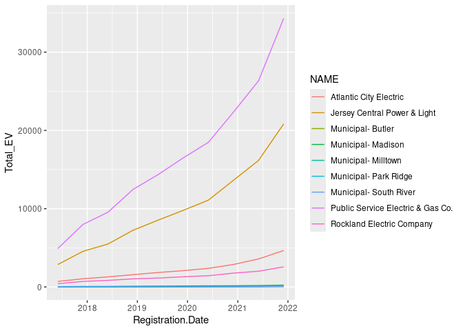

# What is the impact of utility companies’ charging station rebates on
EV adoption in Maryland?


Step 1. Install necessary packages.

``` r
install.packages("tidyverse")
```

    Installing package into '/cloud/lib/x86_64-pc-linux-gnu-library/4.4'
    (as 'lib' is unspecified)

``` r
install.packages("kableExtra")
```

    Installing package into '/cloud/lib/x86_64-pc-linux-gnu-library/4.4'
    (as 'lib' is unspecified)

Step 2. Declare that you will use these packages in this session.

``` r
library("tidyverse")
```

    ── Attaching core tidyverse packages ──────────────────────── tidyverse 2.0.0 ──
    ✔ dplyr     1.1.4     ✔ readr     2.1.5
    ✔ forcats   1.0.0     ✔ stringr   1.5.1
    ✔ ggplot2   3.5.1     ✔ tibble    3.2.1
    ✔ lubridate 1.9.3     ✔ tidyr     1.3.1
    ✔ purrr     1.0.2     
    ── Conflicts ────────────────────────────────────────── tidyverse_conflicts() ──
    ✖ dplyr::filter() masks stats::filter()
    ✖ dplyr::lag()    masks stats::lag()
    ℹ Use the conflicted package (<http://conflicted.r-lib.org/>) to force all conflicts to become errors

``` r
library("kableExtra")
```


    Attaching package: 'kableExtra'

    The following object is masked from 'package:dplyr':

        group_rows

Step 3. Upload the dataframe that you have created in Spring 2024 into
the repository.

Step 4. Open the dataframe into the RStudio Environment.

``` r
df<-read.csv("merged.csv") %>%
  select(-X)
```

Step 5. Use the **head** and **kable** function showcase the first 10
rows of the dataframe to the reader.

``` r
kable(head(df))
```

| Zip_Code | Year_Month | Company | Count | Date | StationRebate |
|---:|:---|:---|---:|:---|---:|
| 20464 | 2020/07 | Southern Maryland Electric Cooperative Inc. | 0 | 2020-07-01 | 0 |
| 20464 | 2020/08 | Southern Maryland Electric Cooperative Inc. | 0 | 2020-08-01 | 0 |
| 20464 | 2020/09 | Southern Maryland Electric Cooperative Inc. | 0 | 2020-09-01 | 0 |
| 20464 | 2020/10 | Southern Maryland Electric Cooperative Inc. | 0 | 2020-10-01 | 0 |
| 20464 | 2020/11 | Southern Maryland Electric Cooperative Inc. | 0 | 2020-11-01 | 0 |
| 20464 | 2020/12 | Southern Maryland Electric Cooperative Inc. | 0 | 2020-12-01 | 0 |

## Question 1: What is the frequency of this data frame?

Answer: Monthly from 7/2020 to 8/2024

## Question 2: What is the cross-sectional (geographical) unit of this data frame?

Answer: Zipcode

Step 6. Use the **names** function to display all the variables (column)
in the dataframe.

``` r
names(df)
```

    [1] "Zip_Code"      "Year_Month"    "Company"       "Count"        
    [5] "Date"          "StationRebate"

## Question 3: Which column represents the treatment variable of interest?

Answer: StationRebate

## Question 4: Which column represents the outcome variable of interest?

Answer: Count (EV Sales)

Step 7: Create a boxplot to visualize the distribution of the outcome
variable under treatment and no treatment.

``` r
df_BGE <- df %>%
  filter(Company == "Baltimore Gas & Electric Co")

df_SMECO <- df %>%
  filter(Company == "Southern Maryland Electric Cooperative Inc.")

ggplot(df_BGE, aes(x=Count)) +
  geom_histogram() +
  facet_wrap(~StationRebate)
```

    `stat_bin()` using `bins = 30`. Pick better value with `binwidth`.



``` r
ggplot(df_SMECO, aes(x=Count)) +
  geom_histogram() +
  facet_wrap(~StationRebate)
```

    `stat_bin()` using `bins = 30`. Pick better value with `binwidth`.


Step 8: Fit a regression model $y=\beta_0 + \beta_1 x + \epsilon$ where
$y$ is the outcome variable and $x$ is the treatment variable. Use the
**summary** function to display the results.

``` r
data_combined<- rbind(df_BGE, df_SMECO)
model1<-lm(Count ~ StationRebate, data=data_combined)

summary(model1)
```


    Call:
    lm(formula = Count ~ StationRebate, data = data_combined)

    Residuals:
        Min      1Q  Median      3Q     Max 
    -125.97 -121.97  -58.97   29.03 2392.03 

    Coefficients:
                  Estimate Std. Error t value Pr(>|t|)    
    (Intercept)     51.147      5.355   9.552   <2e-16 ***
    StationRebate   74.820      5.731  13.055   <2e-16 ***
    ---
    Signif. codes:  0 '***' 0.001 '**' 0.01 '*' 0.05 '.' 0.1 ' ' 1

    Residual standard error: 205.2 on 11548 degrees of freedom
    Multiple R-squared:  0.01454,   Adjusted R-squared:  0.01446 
    F-statistic: 170.4 on 1 and 11548 DF,  p-value: < 2.2e-16

## Question 5: What is the predicted value of the outcome variable when treatment=0?

Answer: 51

## Question 6: What is predicted value of the outcome variable when treatment=1?

Answer: 126

## Question 7: What is the equation that describes the linear regression above? Please include an explanation of the variables and subscripts.

Answer: $$
Count = \beta_0 + \beta_1 StationRebate + \epsilon
$$ y = 74.820x + 51.147 51.147 is the intercept (average EV count sales
when no station rebates), and 74.820 is the slope and what the EV count
increases by when there are station rebates

## Question 8: What fixed effects can be included in the regression? What does each fixed effects control for? Please include a new equation that incorporates the fixed effects.

Answer: Fixed effects include Month/Year, Zipcode, Company, and Date

\## Question 9: What is the impact of the treatment effect once fixed
effects are included?

``` r
install.packages("lfe")
```

    Installing package into '/cloud/lib/x86_64-pc-linux-gnu-library/4.4'
    (as 'lib' is unspecified)

``` r
library("lfe")
```

    Loading required package: Matrix


    Attaching package: 'Matrix'

    The following objects are masked from 'package:tidyr':

        expand, pack, unpack

``` r
model2<-felm(Count ~ StationRebate | Zip_Code + Year_Month + Company + Date,data=data_combined)

summary(model2)
```


    Call:
       felm(formula = Count ~ StationRebate | Zip_Code + Year_Month +      Company + Date, data = data_combined) 

    Residuals:
        Min      1Q  Median      3Q     Max 
    -671.92  -32.14    2.88   33.08 1490.62 

    Coefficients:
                  Estimate Std. Error t value Pr(>|t|)    
    StationRebate   -45.25      11.95  -3.787 0.000153 ***
    ---
    Signif. codes:  0 '***' 0.001 '**' 0.01 '*' 0.05 '.' 0.1 ' ' 1

    Residual standard error: 96.16 on 11219 degrees of freedom
    Multiple R-squared(full model): 0.7897   Adjusted R-squared: 0.7835 
    Multiple R-squared(proj model): 0.001277   Adjusted R-squared: -0.0281 
    F-statistic(full model):127.7 on 330 and 11219 DF, p-value: < 2.2e-16 
    F-statistic(proj model): 14.34 on 1 and 11219 DF, p-value: 0.0001533 
    *** Standard errors may be too high due to more than 2 groups and exactDOF=FALSE

Answer:

# Questions for Week 5

## Question 10: In a difference-in-differences (DiD) model, what is the treatment GROUP?

Answer:

## Question 11: In a DiD model, what are the control groups?

Answer:

## Question 12: What is the DiD regression equation that will answer your research question?

## Question 13: Run your DiD regressions below. What are the results of the DiD regression?

## Question 14: What are the next steps of your research?

Step 9: Change the document format to gfm

Step 10: Save this document as README.qmd

Step 11: Render the document. README.md file should be created after
this process.

Step 12: Push the document back to GitHub and observe your beautiful
document in your repository!

Step 13: If your team has a complete dataframe that includes both the
treated and outcome variable, you are done with the assignment. If not,
make a research plan in Notion to collect data on the outcome and
treatment variable and combine it into one dataframe.
