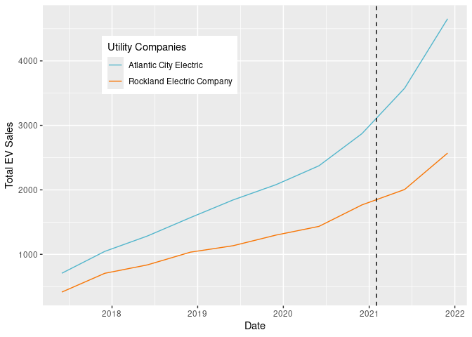

# What is the impact of utility companies’ charging station rebates on EV adoption in New Jersey?


## Introduction:

Electric vehicle (EV) adoption is consistently increasing, and one of
the most challenging aspects is the transition from gasoline-powered
vehicles to electric ones. The difficulties rise due to the struggle to
provide affordable charging infrastructure. In the state of New Jersey,
many utility companies, like Public Service Electric and Gas (PSEG) and
Atlantic City Electric (ACE), are starting to offer rebates and
incentives for the purpose of installing EV charging stations in various
counties to maintain widespread accessibility (Qmerit, 2024). As of
2021, PSEG and ACE are now accessible for the purpose of reducing
financial struggles of the public in today’s society.

To install an EV charging station at home, the cost can vary from \$500
to \$2,000. There can also be other costs for any other upgrades that
are needed. PSEG offers \$1,500 for an installation of a Level 2
charging station and a \$5,000 discount for utility-side make-ready
costs. ACE covers up to \$5000 or 75% of the installation cost for an EV
charger. Rebates function in a way where there is an amount of
reimbursement for some of the installation costs. This lowers the
expenses that residents have to pay when they put their stations in
place.

Our research is important to society because New Jersey contains a high
urban environment (New Jersey’s cleanenergy program, 2020). The high
urban environment has dense populations as well as more chances of
traffic, so this reduces any greenhouse gasses that are exerted.These
charging station rebates lead to clean transportation choices and offer
awareness to the public about the importance of positive EV consumption
(US Department of Transportation, 2023). This research used to promote
residents to understand the relationship between rebates and EV adoption
helps New Jersey’s objectives to reducing greenhouse gasses and
promoting healthy energy uses.

## Existing Research:

Electric vehicle (EV) charging rebates are financial incentives that are
given by governments and certain organizations to encourage people to
acquire electric vehicles. When one applies for a rebate after
purchasing an EV charging station, one can receive some money back. This
helps promote cleaner transportation options and makes charging stations
more affordable and convenient. It can cost anywhere from $1,500 to $5,00 depending on the company to install a residential EV charging station. Due to that factor, energy companies have created EV charging station rebate programs to help incentivize people to buy EVs. 

This study will build on existing
findings and delve deeper into the impact of utility companies’ charging
station rebates on electric vehicle adoption. Despite there being some
research done on similar topics, there are noticeable gaps. Certain
studies have focused on border areas from a geographical standpoint, or
also lack specific information on the impact of rebates on EV adoption
rates in New Jersey. Other studies also may not have researched consumer
behavior, accessibility affordability, and rebate mechanisms overall.
Muehlegger & Rapson (2022) studied EV adoption in California and helped
strengthen our data when focusing on New Jersey by using reliable
comparisons (Muehlegger & Rapson, 2022). The state of California gives a
broader perspective of what the subsidies and purchases of EVs are from
another geographic location. Clinton & Steinberg (2019) explained the
relationship between financial incentives and EV adoption through its
lessons (Clinton & Steinberg, 2019). Our study will address those gaps
due to focusing strictly on New Jersey and its direct impact of the
rebates on EV adoption.

## Data Description:

### Outcome Variable:

- The outcome variable is Vehicle.Count (EV sales) in the zip codes in
  New Jersey. This measures the number of electric vehicles registered,
  which serves as a proxy for EV adoption in response to the treatment
  (rebate programs).

### Treatment Variable:

- The treatment variable is the rebate programs offered by the utility
  companies (AEC_Rebate, PSEG_Rebate). These rebates are intended to
  encourage the installation of EV charging stations, which, in turn,
  could increase EV adoption.

- **PSEG:**  Electric Vehicle Charging Program which was implemented on
  June 15, 2021, offers \$1,500 for Level 2 EVSE make-ready
  infrastructure. \$5,000 discount for utility-side make-ready costs.

- **Atlantic City Electric:** Residential Charger Rebate Program
  implemented on February 17, 2021, rebate up to 75% of electrical
  upgrade costs – or a maximum of \$5,000 – for installing an EV charger
  at home. In overburdened communities, 100% of the cost is covered.

### Frequency/Geographic Unit:

- Frequency: The dataset is semi-annual, with observations collected
  every six months from 2016 to 2023.

- Geographic Unit: The data is organized by zip code.

### Treated and Untreated Group:

- Treated Group: Zip codes served by utility companies that provide
  rebates before the first half of 2022, specifically AEC and PSEG.

- Untreated Group: Zip codes served by utility companies that do not
  provide rebates before the first half of 2022, specifically OR
  (Rockland Electric Company) and JCP&L (Jersey Central Power & Light).


### Data Cleaning and Analysis:

Step 1: Show the initial dataframe

``` r
df<-read.csv("panel (1).csv")
```

``` r
kable(head(df))
```

| X | ZIP.Code | NAME | Registration.Date | Vehicle.Count | AEC_Rebate | AEC | PSEG_Rebate | PSEG | REC_Rebate | REC | JCPL_Rebate | JCPL |
|---:|---:|:---|:---|---:|---:|---:|---:|---:|---:|---:|---:|---:|
| 1 | 7001 | Public Service Electric & Gas Co. | 2019-06-01 | 21 | 0 | 0 | 0 | 1 | 0 | 0 | 0 | 0 |
| 2 | 7001 | Public Service Electric & Gas Co. | 2021-06-01 | 45 | 1 | 0 | 0 | 1 | 0 | 0 | 0 | 0 |
| 3 | 7001 | Public Service Electric & Gas Co. | 2022-06-01 | 59 | 1 | 0 | 1 | 1 | 0 | 0 | 0 | 0 |
| 4 | 7001 | Public Service Electric & Gas Co. | 2017-06-01 | 5 | 0 | 0 | 0 | 1 | 0 | 0 | 0 | 0 |
| 5 | 7001 | Public Service Electric & Gas Co. | 2021-12-01 | 53 | 1 | 0 | 1 | 1 | 0 | 0 | 0 | 0 |
| 6 | 7001 | Public Service Electric & Gas Co. | 2022-12-01 | 67 | 1 | 0 | 1 | 1 | 1 | 0 | 1 | 0 |

Step 2: Create a plot to visualize the distribution of the outcome
variable under treatment and no treatment.

``` r
df2 <- df %>%
  mutate(Registration.Date = as.Date(Registration.Date)) %>%
  filter(Registration.Date < as.Date("2022-06-01")) %>%
  group_by(Registration.Date, NAME, AEC_Rebate, PSEG_Rebate, AEC, PSEG) %>%
  summarize(Total_EV = sum(Vehicle.Count))

JCPLandPSEG <- df2 %>%
  filter(NAME == "Public Service Electric & Gas Co." |
         NAME == "Jersey Central Power & Light")

ACEandREC <- df2 %>%
  filter(NAME == "Atlantic City Electric" | 
         NAME == "Rockland Electric Company")

ggplot(JCPLandPSEG, aes(x = Registration.Date, y = Total_EV, color = NAME)) + geom_line() + geom_vline(xintercept = as.Date("2021-06-15"), linetype = "dashed") + theme(legend.position = c(0.3, 0.8)) + 
  scale_color_manual(values = c("Public Service Electric & Gas Co." = "purple", 
  "Jersey Central Power & Light" = "cyan4")) +
  labs(y="Total EV Sales", x="Date", color = "Utility Companies")
```


``` r
ggplot(ACEandREC, aes(x = Registration.Date, y = Total_EV, color = NAME)) + geom_line() + geom_vline(xintercept = as.Date("2021-02-01"), linetype = "dashed") + theme(legend.position = c(0.3, 0.8)) + scale_color_manual(values = c("Atlantic City Electric" = "purple", 
  "Rockland Electric Company" = "cyan4")) +
  labs(y="Total EV Sales", x="Date", color = "Utility Companies")
```



## Preliminary Regression Results:

    Rows: 8,442
    Columns: 13
    $ X                 <int> 1, 2, 3, 4, 5, 6, 7, 8, 9, 10, 11, 12, 13, 14, 15, 1…
    $ ZIP.Code          <int> 7001, 7001, 7001, 7001, 7001, 7001, 7001, 7001, 7001…
    $ NAME              <chr> "Public Service Electric & Gas Co.", "Public Service…
    $ Registration.Date <chr> "2019-06-01", "2021-06-01", "2022-06-01", "2017-06-0…
    $ Vehicle.Count     <int> 21, 45, 59, 5, 53, 67, 187, 14, 10, 130, 40, 30, 28,…
    $ AEC_Rebate        <int> 0, 1, 1, 0, 1, 1, 1, 0, 0, 1, 0, 0, 0, 0, 0, 0, 1, 1…
    $ AEC               <int> 0, 0, 0, 0, 0, 0, 0, 0, 0, 0, 0, 0, 0, 0, 0, 0, 0, 0…
    $ PSEG_Rebate       <int> 0, 0, 1, 0, 1, 1, 1, 0, 0, 1, 0, 0, 0, 0, 0, 0, 0, 1…
    $ PSEG              <int> 1, 1, 1, 1, 1, 1, 1, 1, 1, 1, 1, 1, 1, 1, 1, 1, 1, 1…
    $ REC_Rebate        <int> 0, 0, 0, 0, 0, 1, 1, 0, 0, 1, 0, 0, 0, 0, 0, 0, 0, 1…
    $ REC               <int> 0, 0, 0, 0, 0, 0, 0, 0, 0, 0, 0, 0, 0, 0, 0, 0, 0, 0…
    $ JCPL_Rebate       <int> 0, 0, 0, 0, 0, 1, 1, 0, 0, 1, 0, 0, 0, 0, 0, 0, 0, 1…
    $ JCPL              <int> 0, 0, 0, 0, 0, 0, 0, 0, 0, 0, 0, 0, 0, 0, 0, 0, 0, 0…

``` r
df4 <- df2 %>%
  filter(NAME == "Jersey Central Power & Light" | NAME == "Public Service Electric & Gas Co.")
  
model1 <- felm(Total_EV ~ PSEG*PSEG_Rebate, data=df4)
summary(model1)
```


    Call:
       felm(formula = Total_EV ~ PSEG * PSEG_Rebate, data = df4) 

    Residuals:
        Min      1Q  Median      3Q     Max 
    -9861.1 -3565.6  -141.8  2632.1 11569.9 

    Coefficients:
                     Estimate Std. Error t value Pr(>|t|)    
    (Intercept)          8819       1927   4.577  0.00031 ***
    PSEG                 5950       2725   2.184  0.04423 *  
    PSEG_Rebate         12009       6093   1.971  0.06626 .  
    PSEG:PSEG_Rebate     7524       8616   0.873  0.39542    
    ---
    Signif. codes:  0 '***' 0.001 '**' 0.01 '*' 0.05 '.' 0.1 ' ' 1

    Residual standard error: 5780 on 16 degrees of freedom
    Multiple R-squared(full model): 0.5663   Adjusted R-squared: 0.4849 
    Multiple R-squared(proj model): 0.5663   Adjusted R-squared: 0.4849 
    F-statistic(full model):6.963 on 3 and 16 DF, p-value: 0.003277 
    F-statistic(proj model): 6.963 on 3 and 16 DF, p-value: 0.003277 

``` r
df5 <- df2 %>%
  filter (NAME == "Atlantic City Electric" | NAME == "Rockland Electric Company")

model2 <- felm(Total_EV ~ AEC*AEC_Rebate, data=df5)
summary(model2)
```


    Call:
       felm(formula = Total_EV ~ AEC * AEC_Rebate, data = df5) 

    Residuals:
         Min       1Q   Median       3Q      Max 
    -1015.38  -388.53     5.75   356.47  1149.62 

    Coefficients:
                   Estimate Std. Error t value Pr(>|t|)    
    (Intercept)      1078.2      209.6   5.145 9.78e-05 ***
    AEC               644.1      296.4   2.173   0.0451 *  
    AEC_Rebate       1209.8      468.6   2.581   0.0201 *  
    AEC:AEC_Rebate   1182.9      662.7   1.785   0.0933 .  
    ---
    Signif. codes:  0 '***' 0.001 '**' 0.01 '*' 0.05 '.' 0.1 ' ' 1

    Residual standard error: 592.8 on 16 degrees of freedom
    Multiple R-squared(full model): 0.7323   Adjusted R-squared: 0.6821 
    Multiple R-squared(proj model): 0.7323   Adjusted R-squared: 0.6821 
    F-statistic(full model):14.59 on 3 and 16 DF, p-value: 7.685e-05 
    F-statistic(proj model): 14.59 on 3 and 16 DF, p-value: 7.685e-05 

## Question 1: What is the predicted value of the outcome variable when treatment=0?

Answer: 1078 EV sales for all zip codes covered by Rockland, 8819 EV
sales for all zip codes covered by JCPL (without the treated zipcodes
which are AEC and PSEG)

## Question 2: What is predicted value of the outcome variable when treatment=1?

Answer: AEC: 1078 + 644 + 1210 + 1183 = 4115

PSEG: 8819 + 5950 + 12009 + 7524 = 34302

Question 3: What is the equation that describes the linear regression
above? Please include an explanation of the variables and subscripts.

$$ y = \beta_0 + \beta_1 AEC_C + \beta_2 AECRebate_T + \beta_3 AEC_C*AECRebate_T + \beta_4  + \beta_5 PSEG_C + \beta_6 PSEGRebate_T + \beta_7 PSEG_C*PSEGRebate_T $$

y represents the expected amount of vehicle sales in the zip codes
covered by AEC and PSEG in New Jersey. C represents company and T
represents the rebate time. When calculating the impact on PSEG treated
areas, the AEC values are 0 and viceversa.

|  |  |  |
|----|----|----|
|   | **Model 1 (Atlantic, Rockland)** | **Model 2 (JCPL, PSEG)** |
| **Estimated Impact** | 1828 | 13474 |
| **Controls** | AEC, AEC_Rebate | PSEG, PSEG_Rebate |
| **Obs** | 20 | 20 |
| **R2** | 0.73 | 0.57 |

## Conclusion:

In conclusion, we examined four electricity companies, Public Service
Electric & Gas (PSEG), Atlantic City Electric (ACE), Rockland Electric
Company (REC), and Jersey City Electric and Power (JCPL), in the state
of New Jersey to see how their rebate programs implemented the adoption
of electric vehicles. To be more specific, we compared ACE to REC and
JCPL to PSEG, as the pairs had similar trends in the number of EVs in
zipcodes covered by them.

Starting with ACE and REC, the AEC rebate was implemented in 2021 before
REC’s in 2022, so we decided to compare the increase in EVs caused by
the AEC rebate. After running the model, we found our intercept to be
1078, which would’ve been the amount of EV sales in REC’s region per 6
months without any rebates, and the number of EVs in ACE’s region to be
1078 + 644 = 1722. Now, with the AEC rebate, the model predicted the
number of EV sales to in AEC’s region to grow to 1078 + 644 + 1210 +
1183 = 4115, while the number of EV’s in REC’s region to grow to 1078 +
1209 = 2287. **Thus the impact of the AEC rebate is around 4115 - 2287 =
1828 EVs.**

Continuing with PSEG and JCPL, the PSEG rebate was also implemented in
2021 before JCPL’s in 2022, so we decided to compare the increase in EVs
caused by the PSEG rebate. After running the model, we found our
intercept to be 8819, which would’ve been the amount of EV sales in
JCPL’s region per 6 months without any rebates, and the number of EVs in
PSEG’s region to be 8819 + 5950 = 14, 769 before its rebate was
implemented. Then, once the PSEG rebate was implemented, the model
predicted the number of EV sales in PSEG’s region to grow to 8819 +
5950 + 12009 + 7524 = 34302 EVs while the number of EV’s in JCPL’s
region to grow to 8819 + 12009 = 20828 EVs. **Thus the impact of the
PSEG rebate is around 34302 - 20828 = 13474 EVs.**

## Future Plans:

Our future plans include a more detailed analysis taking other variables
into account. For example, we could look at electricity costs in
different seasons to see if that impacts the perceived benefit of EV
charging station rebates. We also plan to look at other states and
rebate policies based on the data available. This would help us compare
our preliminary results of New Jersey to other states to see if trends
are similar.

## Bibliography:

Clinton, B. C., & Steinberg, D. C. (2019). Providing the Spark: Impact
of financial incentives on battery electric vehicle adoption. Journal of
Environmental Economics and Management, 98, 102255.
https://doi.org/10.1016/j.jeem.2019.102255 

Electric Vehicle Incentive Programs \| NJ OCE Web Site. (2020).
Njcleanenergy.com.
https://www.njcleanenergy.com/ev?gad_source=1&gclid=Cj0KCQiA_qG5BhDTARIsAA0UHSIhzHJDWQ_QdSyRdiJZgAbI6xi1JgecGyTVxcU6rW_Zgq9IrJDr1wAaAh9FEALw_wcB 

EV Residential Charging Program. EV Residential Charging Program -
PSE&G. (n.d.).
https://nj.myaccount.pseg.com/myservicepublic/electricvehicles-residential-program

EV promotions & tax credits.
(n.d.).https://jerseycentral.chooseev.com/promos/#:~:text=Through%20JCP&L’s%20EV%20Driven%20Program,at%20each%20qualifying%20installation%20site

Muehlegger, E., & Rapson, D. S. (2022). Subsidizing low- and
middle-income adoption of electric vehicles: Quasi-experimental evidence
from California. Journal of Public Economics, 216(216), 104752.
https://doi.org/10.1016/j.jpubeco.2022.104752 

New Jersey EV Rebates & Charging Incentives (2024, July). Qmerit.
https://qmerit.com/location/new-jersey/ 

Orange & Rockland. (n.d.).
https://www.oru.com/en/our-energy-future/electric-vehicles/new-jersey/residential-ev-drivers/charger-ready-for-home

Residential Charger Rebate. Atlantic City Electric. (n.d.).
https://www.atlanticcityelectric.com/smart-energy/innovation-technology/residential-charger-rebate
